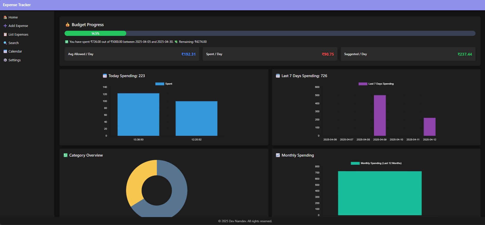
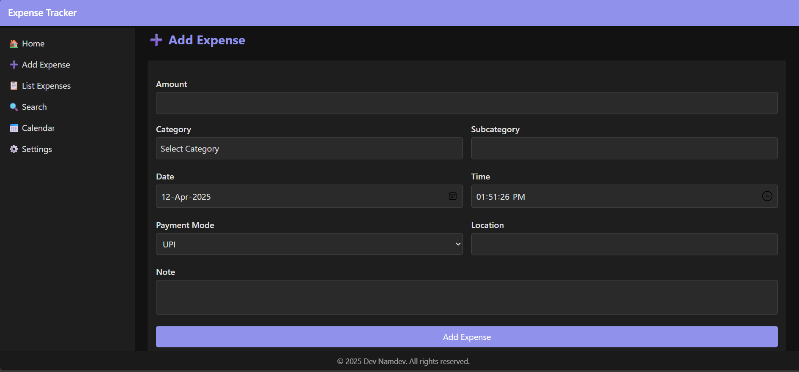
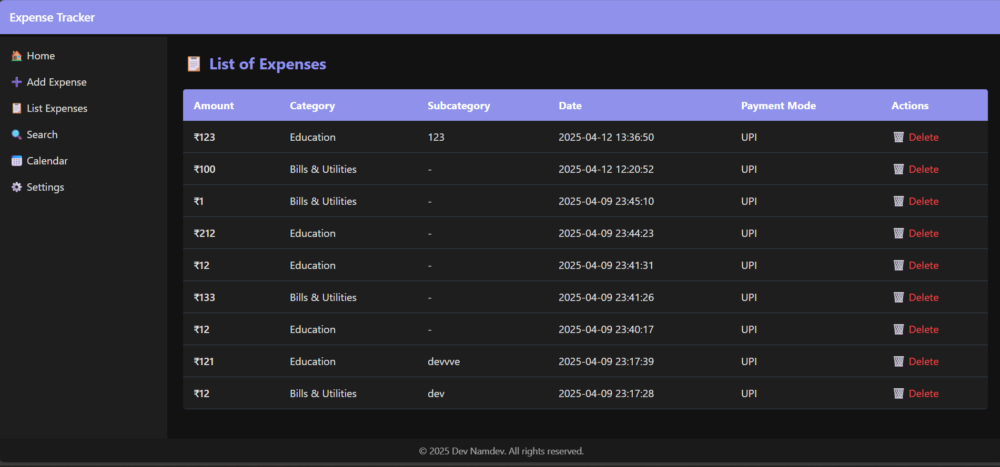
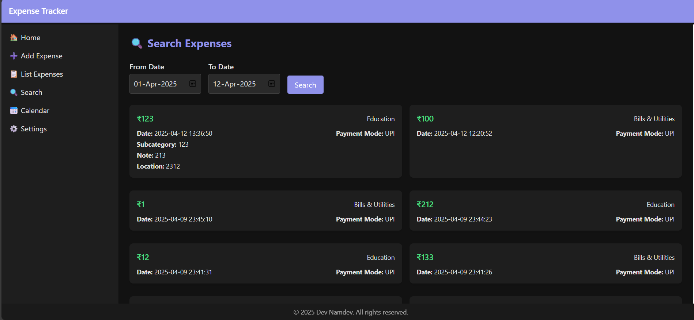
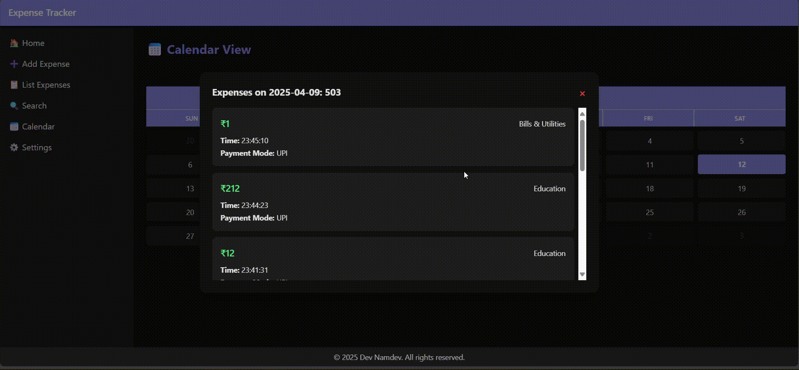
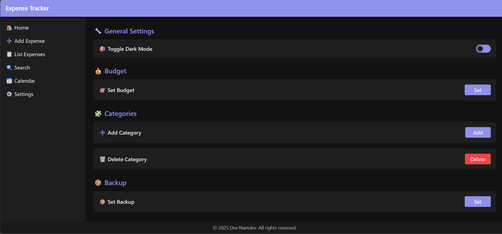

# 📘 Expense Tracker

>### Expense Wisely – Where Your Money Stops Playing Hide and Seek!

## ✅ Overview

The **Expense Tracker Application** helps users manage their personal finances through intuitive UI components, visual analytics, and simple interaction patterns. The application is fully front-end based, leveraging `localStorage` for data persistence.

---

 

## 💡 Features

- Add and categorize expenses with rich metadata.
- Real-time visual analysis using charts (daily, weekly, monthly).
- Budget management with progress tracking.
- Calendar view for date-wise expense breakdown.
- Sorting, filtering, and searching of expenses.
- Light/Dark theme toggle and full settings configuration.
- Supports both predefined and custom categories.
- Backup settings for future cloud sync capability.

---

## 🧭 Page-wise Functionality

### 1. **Home Page**
Displays all key metrics and analytics:
- **Budget Progress**: Visual bar with % used, allowed/spent/suggested per day.
- **Charts**:
  - Daily Spending (bar/line)
  - Last 7 Days
  - Monthly Overview
  - Category Overview (doughnut/pie)

### 2. **Add Expense Page**
Form to record new expenses:
- Fields:
  - Amount
  - Category & Subcategory
  - Date and Time
  - Note (optional)
  - Payment Mode (UPI or Cash)

### 3. **Expense List Page**
Tabular view of all expenses with:
- Sortable columns (by amount, category, date, etc.)
- Pagination or scrolling support for large data sets

### 4. **Search Page**
- Filter expenses by **From Date** and **To Date**
- List all matching results in a detailed view

### 5. **Calendar Page**
- Visual calendar UI
- Clicking on a date opens a modal displaying all expenses on that specific day

### 6. **Settings Page**
- Switch between **Dark Mode** and **Light Mode**
- Set budgets (monthly or custom range)
- Add/Delete categories
- Backup settings

---

## 📂 Data Management (localStorage)

All data is stored in the browser's `localStorage`. Each major data type (expenses, categories, settings, etc.) is maintained in its respective storage key.

---

## 📊 Database Schemas

### 🧾 Expense Schema

```js
{
  amount: "",
  category_id: "",
  date: "",
  expense_id: "",
  location: "",
  note: "",
  payment_mode: "", // e.g., "UPI" or "Cash"
  subcategory: "",
  time: ""
}
```

### 📁 Category Schema

```js
{
  category_id: 1,
  name: "Food & Drinks",
  icon: "🍔",
  color: "#f94144"
}
```

### 🧰 Custom Category Schema

```js
{
  category_id: "",
  name: "",
  icon: "",
  color: ""
}
```

### ⚙️ Settings Schema

```js
{
  themeMode: "",
  notifications: true,
  backupFrequency: "",
  isBackup: false
}
```

### 📅 Budget Schema

```js
{
  id: "",
  amount: 0,
  fromDate: "",
  toDate: ""
}
```

---

## 📈 Charts and Visualization

The app uses `Chart.js` to display visual statistics:
- **Daily Chart** – Spending today
- **Last 7 Days** – Weekly analysis
- **Monthly Chart** – Month-wise data
- **Category Chart** – Expense distribution by category
- Each chart dynamically updates based on data changes

---

## ⚙️ Settings and Personalization

Users can customize their experience with:
- Theme toggle (light/dark)
- Add/remove categories
- Set budgets with date range
- Configure backup frequency (for future enhancements)

---

## 🔄 Backup & Sync

- A backup system is designed using the `isBackup` flag and `backupFrequency`
- Future integration planned with cloud/local file system

---

## 📌 Usage Guide

### Adding an Expense
1. Go to "Add Expense" tab
2. Fill in details (amount, category, date/time, etc.)
3. Click **Submit** – the data is stored in localStorage and reflected across the app

### Viewing Reports
- Navigate to Home to view detailed spending analytics

### Managing Budget
- Head to **Settings > Set Budget**
- Set monthly or custom range with allowed budget

### Viewing Daily Expenses
- Go to **Calendar Page**
- Click any date to view expenses via modal

### Backup
- Enable `Backup` in **Settings**
- Configure backup frequency (daily/weekly/monthly)

---

## 🖼️ Screenshots

Below are visual previews of the Expense Tracker application to provide better insight into its user interface and functionality.

### 📊 Home Page – Dashboard Overview
Displays budget progress and various charts for spending analytics.


### ➕ Add Expense Page
Simple and clean form to add new expenses with all required fields.


### 📃 Expense List
Tabular view of all recorded expenses with sorting capabilities.


### 🔍 Search by Date Range
Filter and display expenses between selected dates.


### 📅 Calendar View
Visual calendar UI to access expenses on a specific day.


### ⚙️ Settings Panel
Includes theme toggle, budget setup, category management, and backup options.


---